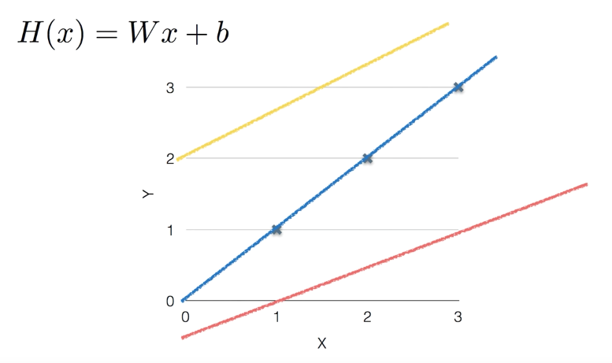
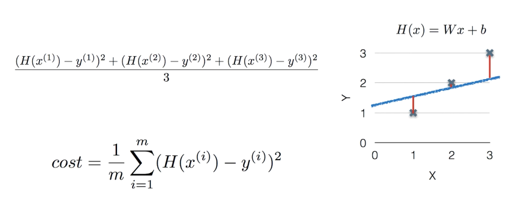
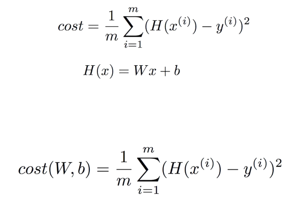
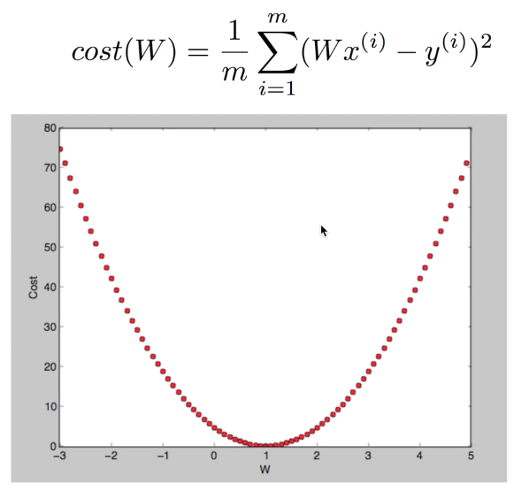
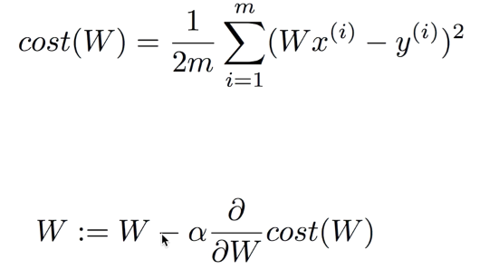
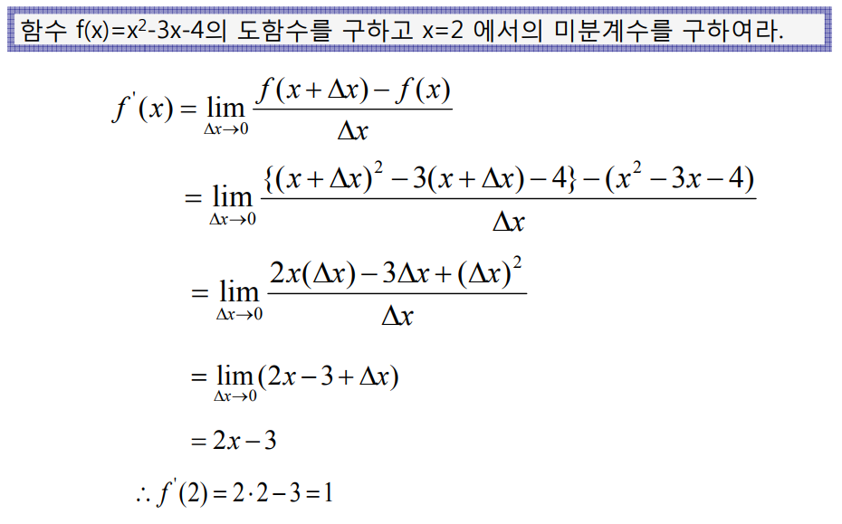
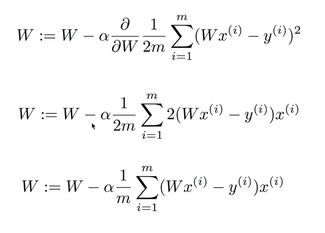
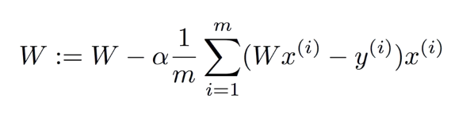

# Machine Learning

Limitations of explicit programming

> "Fiend of study that givew computers the ability to lerarn without being explicitly programmed" - Arthur Samuel(1959)

---

# Supervised / Unsupervised

### Supervised learning

Learning with labeled examples - traning set
Most common problem type in ML

### Unsupervised learning: un-labeled data
* Google news grouping
* Word clustering

---

# Types of supervised learning

* Regression
Predicting final exam score based on time spent 
* Binary classification
Pass/non-pass based on time spent
* Multi-label classification
Letter grade(A, B, C, E and F) based on time spent

---

# (Linear) Hypothesis

---

# Cost function

How fit the line to our (training) data

---

# Cost function

---

How to minimize cost
===

---

# What cost(W) looks like?

---

# Gradient descent algorithm

* Minimize cost function
* Gradient descent is used many minimization problems
* For a given cost function, cost(W, b), it will find W, b to minimize cost
* It can be applied to more general function: cost(w1, w2, ...)

---

# How it works?

* Start with initial guesses
  - Start at 0, 0 (or any other value)
  - Keeping changing ***W*** and ***b*** a little bit to try and reduce cost(W, b)
* Each time you change the parameters, you select the gradient which reduces cost(W, b) the most possible
* Repeat
* Do so until you converge to local minimum
* Has an interesting property
  - Where you start can determine which minimum you end up

---

# Formal definition

---

# Study differential

* 개념수업 미분이란 무엇인가
https://www.youtube.com/watch?v=2JvfRLgcmUI
* 미분계수와 도함수
https://www.youtube.com/watch?v=gCbPMWkOXA4&t=531s
* 편미분의 정의
https://www.youtube.com/watch?v=iV6knNujS78&t=612s

---

# Study differential

* 미적분 7일만에 끝내기
http://www.kyobobook.co.kr/product/detailViewKor.laf?barcode=9788952210043

* 미시경제학 - 미분의 개념
http://moducampus.com/assets/uploads/solution/2017/06/7151199dd86a562b945d7332e65c203b.pdf

---

# Study differential

---

# Formal definition

---

# Gradient descent algorithm

---

# Study gradient Descent

* 선형회귀와 Gradient Descent
https://www.youtube.com/watch?v=GmtqOlPYB84