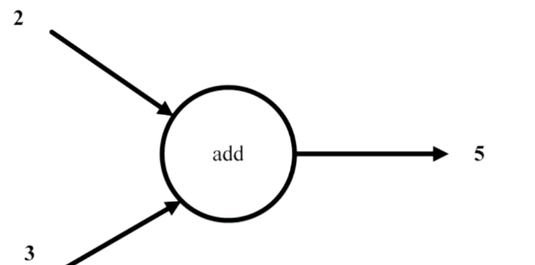
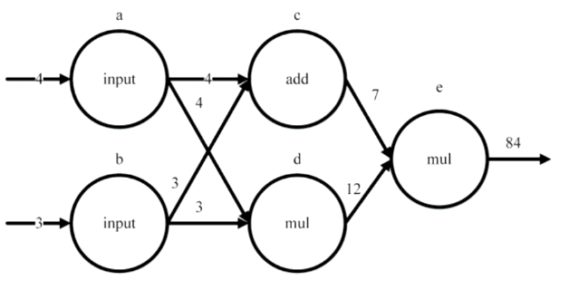
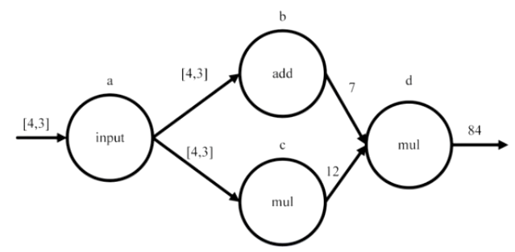

TensorFlow
===

---

# Computation Graph Basics




``` python
a = tf.constant(2, name="input_a")
b = tf.constant(3, name="input_b")

c = tf.add(a, b, name="add_c")
```

---

# Dependency in Computation Graphs



``` python
a = tf.constant(4, name="input_a")
b = tf.constant(3, name="input_b")

c = tf.add(a, b, name="add_c")
d = tf.multiply(a, b, name="mul_d")
e = tf.multiply(c, d, name="mul_e")
```

---

# Using Tensor



``` python
a = tf.constant([4, 3], name="constant_a")

# Computes the sum of elements across dimensions of a tensor.
b = tf.reduce_sum(a, name="sum_b")

# Computes the product of elements across dimensions of a tensor.
c = tf.reduce_prod(a, name="mul_c")

d = tf.multiply(b, c, name="mul_d")
```

---

# Tensor from Python Native Types

Treated as 0-D Tensor, or ***"scalar"***
`t_0 = 50` 

Treated as 1-D Tensor, or ***"vector"***
`t_1 = [1, 3, 3]`

treated as 2-D Tensor, or ***"matrix"***
``` python
t_w = [
  [True, True, False],
  [False, Falsse, True],
  [False, True, False]
]
```

---

# Tensor from NumPy Arrays

0-D Tensor with 32-bit integer data type
`t_0 = np.array(50, dtype=np.int32)`

1-D Tensor with byte string data type
Node: Don't explicitly specify dtype when using strings in NumPy
`t_1 = np.array([b"apple", b"peach", b"grape"])`

2-D Tensor with boolean data type
``` python
t_2 = np.array([
  [True, False, False],
  [False, False, True],
  [False, True, False]
], dtype=np.bool);
```
---

# Tensor Shape

Shape that describes a vector of length
`[1, 2, 3]` has shape `[3]`

Shape that describes matrix

```
[[1,2],
 [3,4],
 [5,6]]
 ```
 has shape `[3, 2]`
 
---
 
# Tensorflow Operations
 
## Add x and y, elementwise

`x + y`
`tf.add()` 
 
## Subtract y from x, elementwise

`x - y`
`tf.subtract()`
 
---

# Tensorflow Operations

## Multiply x and y, elementwise

`x * y`
`tf.multiply()` 

## Divides x / y elementwise 

`x / y`
`tf.div()`

Perform element-wise integer division when givien an integer type tensor, and floating point("true") division on floating point tensors.

