Machine Learning
===

---

# Machine Learning

Limitations of explicit programming

> "Field of study that givew computers the ability to lerarn without being explicitly programmed" - Arthur Samuel(1959)

---

> A computer program is said to **learn** from **experence E** with respect to some class of **tasks T** and **performance measure P**, if its performance at tasks in **T**, as measured by **P**, improves with experience **E** - T.Michell(1997)

---

**Tasks**
* classification: discrete target values
* regression: real target values
* custering: no target values

**Performance**
* classification: 0-1 loss function
* regression: L2 loss function
* custering

**Experience**
* classification: labeled data
* regression: labeled data
* custering: unlabeled data

---

# 학습?

학습은 단순한 암기(memorization)가 아니라,

학습의 과정을 통해 자신도 모르는 사이에
일반화(generalization) 과정을 거치게 되며,

이를 통해 새로운 무엇을 접하더라도 예측(prediction) 할 수 있는
능력을 갖게 하는 것이 바로 학습이다.

---

# Supervised / Unsupervised

### Supervised learning

Learning with labeled examples - traning set
Most common problem type in ML

### Unsupervised learning: un-labeled data
* Google news grouping
* Word clustering

---

# Types of supervised learning

* Regression
Predicting final exam score based on time spent 
* Binary classification
Pass/non-pass based on time spent
* Multi-label classification
Letter grade(A, B, C, E and F) based on time spent

---

# Supervised learning workflow

---

# Training data set

머신이 미리 학습할 데이터
특징(feature)과 결과(labeled)로 구성

[Iris flower data set](https://en.wikipedia.org/wiki/Iris_flower_data_set)

---

# Public data sets

* [Awesome Public Datasets](https://github.com/caesar0301/awesome-public-datasets)
* [Google Public Data](https://www.google.com/publicdata/directory)
* kaggle에 올라오는 논문이나 질문에 포함된 데이터셋

---

Linear Regression
===

---

# Regression Analysis
통계학에서, 회귀분석(回歸分析, 영어: regression analysis)은
관찰된 연속형 변수들에 대해 두 변수 사이의 모형을 구한뒤
적합도를 측정해 내는 분석 방법이다.

---

# Linear Regression

종속 변수 y와 한 개 이상의 독립 변수 (또는 설명 변수) X와의
선형 상관 관계를 모델링하는 회귀분석 기법이다.

한 개의 설명 변수에 기반한 경우에는 단순 선형 회귀,
둘 이상의 설명 변수에 기반한 경우에는 다중 선형 회귀라고 한다.

---

# (Linear) Hypothesis

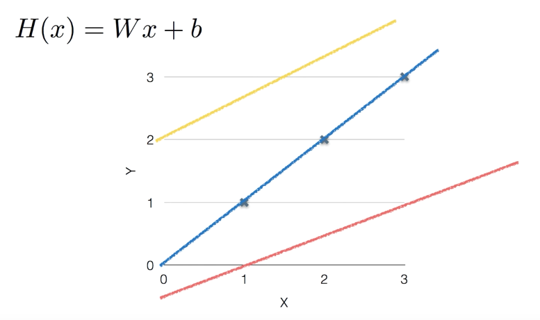

---

# Cost function

How fit the line to our (training) data

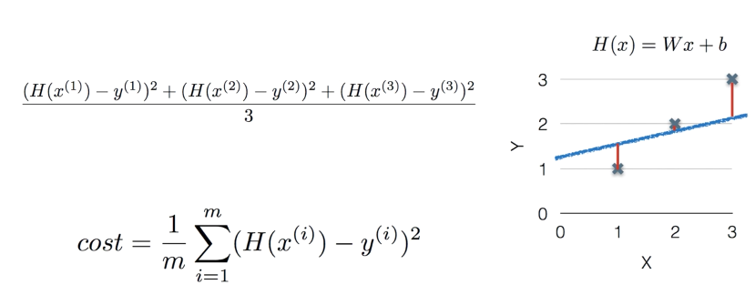

---

# Cost function

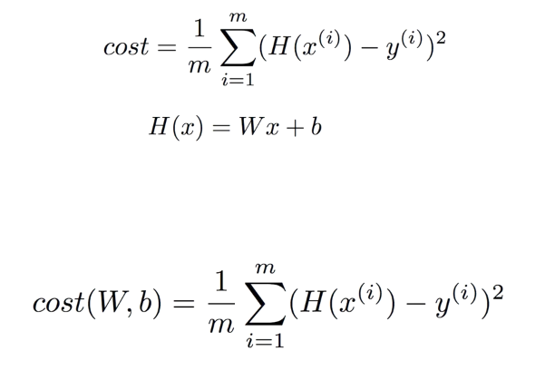

---

How to minimize cost
===

---

# What cost(W) looks like?

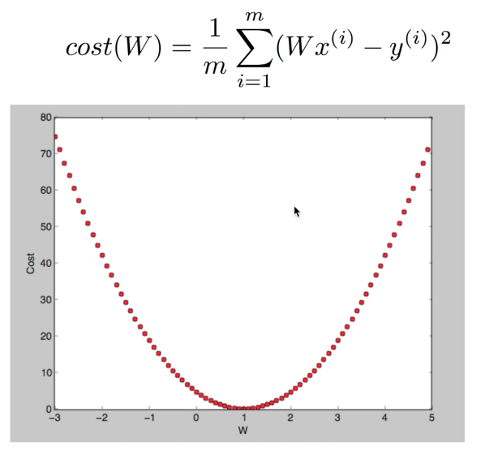

---

# Gradient descent algorithm

* Minimize cost function
* Gradient descent is used many minimization problems
* For a given cost function, cost(W, b), it will find W, b to minimize cost
* It can be applied to more general function: cost(w1, w2, ...)

---

# How it works?

* Start with initial guesses
  - Start at 0, 0 (or any other value)
  - Keeping changing ***W*** and ***b*** a little bit to try and reduce cost(W, b)
* Each time you change the parameters, you select the gradient which reduces cost(W, b) the most possible
* Repeat
* Do so until you converge to local minimum
* Has an interesting property
  - Where you start can determine which minimum you end up

---

# Formal definition

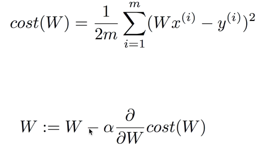

---

# Study differential

* 개념수업 미분이란 무엇인가
https://www.youtube.com/watch?v=2JvfRLgcmUI
* 미분계수와 도함수
https://www.youtube.com/watch?v=gCbPMWkOXA4&t=531s
* 편미분의 정의
https://www.youtube.com/watch?v=iV6knNujS78&t=612s

---

# Study differential

* 미적분 7일만에 끝내기
http://www.kyobobook.co.kr/product/detailViewKor.laf?barcode=9788952210043

* 미시경제학 - 미분의 개념
http://moducampus.com/assets/uploads/solution/2017/06/7151199dd86a562b945d7332e65c203b.pdf

---

# Study differential

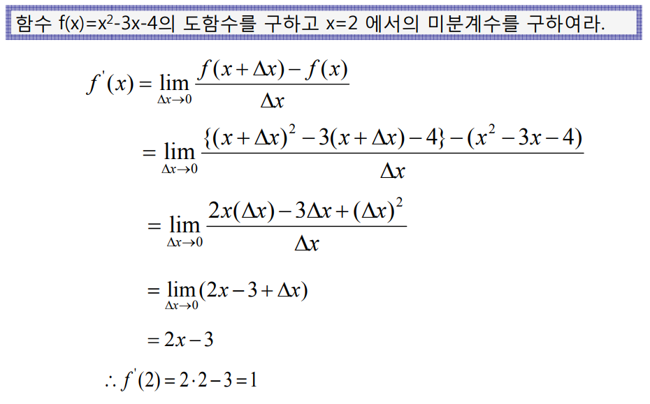

---

# Formal definition

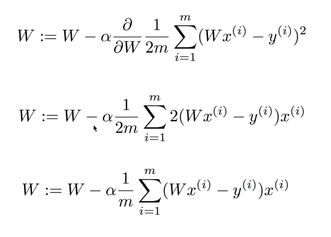

---

# Gradient descent algorithm

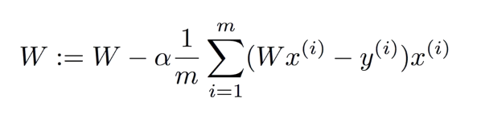

---

# Study gradient Descent

* 선형회귀와 Gradient Descent
https://www.youtube.com/watch?v=GmtqOlPYB84
* Knapsack problem
https://en.wikipedia.org/wiki/Knapsack_problem

---

Multi Variable Linear Regression
===

---

# Multi Variable Liner Regression Hypothesis

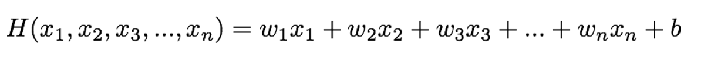

---

# Hypothesis Using Matrix

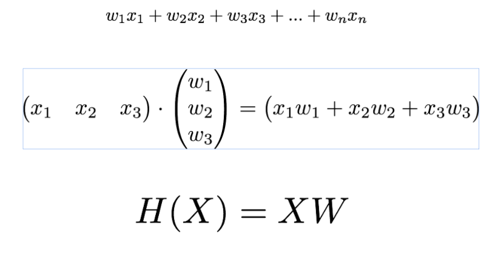

---

Logistic Regression
===

---

# Logistic Regression

로지스틱 회귀(영어: logistic regression)는 D.R.Cox가
1958년에 제안한 확률 모델로서 독립 변수의 선형 결합을 이용하여
사건의 발생 가능성을 예측하는데 사용되는 통계 기법이다.

---

# sigmoid

S자 모양의, 결장(結腸)
y가 0.5에 가까워 진다면 특이사항으로 분류해야

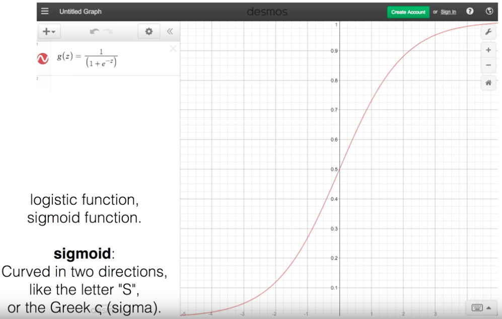

---

# Activation-function-derivatives

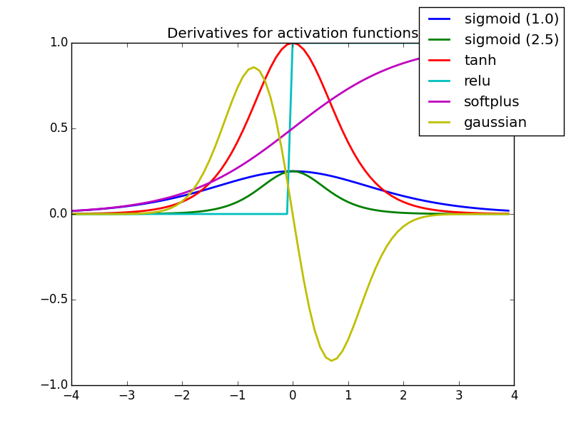

----

# 자연상수

네이피어가 발견
베르누이가 정리
오일러가 출판

https://www.youtube.com/watch?v=ELArhsyt4MA&t=304s

---

# e

2.718281...
무리수
초월수 : 유리수 계수 다항식의 해가 될 수 없다.
자연상수: 많은 분야에서 계산을 자연스럽게 만들어 준다.

---

# Logistic Regression Hypothesis

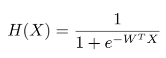

---

# Logistic Regression Cost function

Liner Regression Cost Function을 사용할 수 없다.

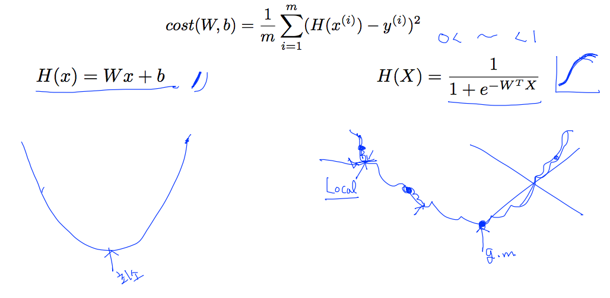

---

# New Cost Function for Logistic

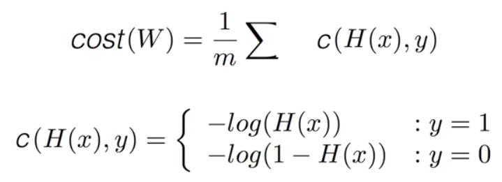

---

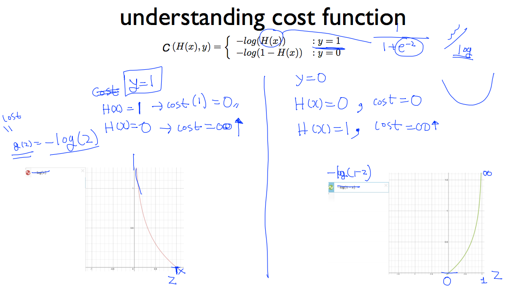

---

# Cost Funtion for Logistic

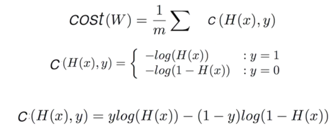

---

# Minimize - Gradient Decent Algorithem

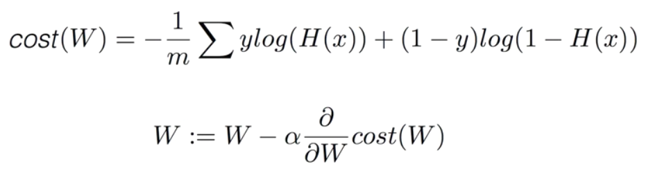

---

# 참고
https://tensorflow.blog/
