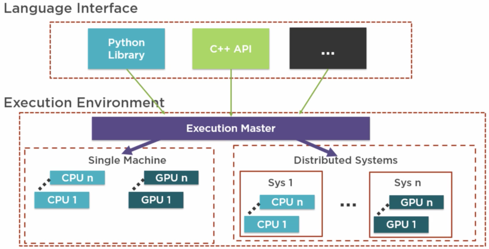

1.Tensorflow Getting Started
===

---

# TensorFlow
An interface for expressing machine learning algorithms 

And an implementation for executing such algorithms

A framework for creating ensemble algorithms
for today's most challenging problems

---

# TensorFlow as an Interface

* Lower level library
* Flexible structure
* Predefined implementation available

---

# TensorFlow as an Implementation for Execution

* Scales up and down
* Easier deployment to production
* Small experiment to industrual strength

---

# TensorFlow Environment



---

# ML/DL Environment


---

# Tensor 

Tensor is n-dimension structure

n = 0 Single value
n = 1 List of vaues
n = 2 Matrix of values

---

# Computation Graph of (a * b) + c


---

# Computation Graph of (a * b) + c
 


"TensorFlow"
***Tensor*** flowing between ***Operations***

---

2.Introducing Tensorflow
===

---

Installing TensorFlow
Creating Models in TensorFlow
Discussing TensorFlow architecture

---

# Installing TensorFlow

## Installation Factors
* OS
* GPU
* Environment
  - Direct, Virtual, or Docker Container
* Python Version
  - Lunuxm, MacOS - 2.7, 3.3 or later
  - Windows - 3.5 or later

---

# Demo

https://www.tensorflow.org/install

---

# Hello TensorFlow

``` python
# import TensorFlow
import tensorflow as tf

sess = tf.Session()

# Verify we can print a string
hello = tf.constant("Hello TensorFlow")
print(sess.run(hello))

# Perform som simple math
a = tf.constant(20)
b = tf.constant(22)
print("a + b = {0}".format(sess.run(a + b)))
```

---

# Demo

* Implement House Price Prediction
* Illustrate TensorFlow Concepts

---

# House_Price_Prediction.py

``` python
import tensorflow as tf
import numpy as np
import math
import matplotlib.pyplot as plt
import matplotlib.animation as animation # import animation support
```

---

``` python
# generation som house sizes between 1000 and 3500 (typical sq ft of house)
num_house = 160
np.random.seed(42)
house_size = np.random.randint(low=1000, high=4500, size=num_house)

# generate house prices from house size with a random noise added
np.random.seed(42)
house_price = house_size * 100.0 + np.random.randint(low=20000, high=70000, size=num_house)
```
---

``` python
# plot generated house and size
plt.plot(house_size, house_price, "bx") # bx = blue x
plt.ylabel("Price")
plt.xlabel("Size")
plt.show()
```
---

# Training a Model with TensorFlow

| Concept | Implementation |
| ------- | -------------- |
| Prepared Data | Generated house size and price data | 
| Inference(추론) | Price = (sizeFactor * size) + priceOffset |
| Loss Measurement | Mean Square Error |
| Optimizer to Minimize Loss | Gradient Descent Optimize |

---

Demo
===

```
House_Price_Prediction.py
```


---

# Tensor

An ***n-dimensional*** array or list used in Tensor to
represent all data.

Defined by the properties,
* ***Rank***
* ***Shape***
* ***Type***

---

# Rank

Dimensionality of a Tensor.

| Rank | Description | Example |
| ---- | ----------- | ------- |
| 0 | Scalar | s = 145 |
| 1 | Vector | v = [1, 3, 2, 5, 7] |
| 2 | Matrix | m = [[1, 5, 6], [5, 3, 4]] |
| 3 | 3-Tensor(cube) | ... |
| n | n-Tensor | ... |

``` python
# 3-Tensor(cube)
c = [ [1, 5, 6], [5, 3, 4] ],
      [9, 3, 5], [3, 4, 9] ],
      [4, 3, 2], [3, 6, 7] ] ]
```

---

# Shape

Shape of data in Tensor. Related to Rank.

| Rank | Description | Example | Shape |
| ---- | ----------- | ------- | ----- |
| 0 | Scalar | s = 145 | [ ] |
| 1 | Vector | v = [1, 3, 2, 5, 7] | [5] |
| 2 | Matrix | m = [[1, 5, 6], [5, 3, 4]] | [2, 3]
| 3 | 3-Tensor(cube) | ... | [3, 2, 3] |

``` python
# 3-Tensor(cube)
c = [ [1, 5, 6], [5, 3, 4] ],
      [9, 3, 5], [3, 4, 9] ],
      [4, 3, 2], [3, 6, 7] ] ]
```

---

# Data Type

* float32, float64
* int8, int16, int32, int64
* uint8, uint16
* string
* bool
* complex64, complex128
* qint8, qint16, quint8