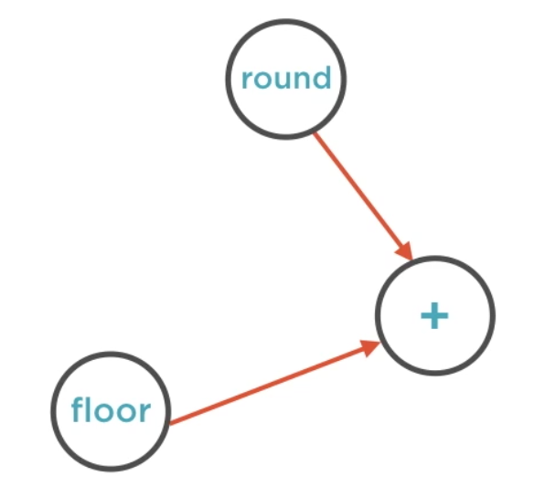

Understanding
The Foundations of
TensorFlow
===

---

Introducing TensorFlow
===

---

Introducing TensorFlow
Pre-requisites and Course Overview
===

---

# Overview

Introduce TensorFlow(TF),  a language for numerical  computations

Understand the basics of machine learning, deep learning and neural networks

Learn why TF is slowly becoming the default library for ML

Install and set up TensorFlow on your local machine

---

# What you Need in Your Toolkit

## Prerequisites
Familiarity with the command line on a Mac, Linux or Windows machine

Comfortable with writing programs in Python

---

## Install and Setup

TBD

---

# Course Overview

***Introduction*** to TensorFlow, install and setup

***Basics*** of TensorFlow, computation graphs, tensors, sessions and TensorBoard

***Fundamentals*** of TensorFlow, placeholders, variables, the feed dictionary

***Working with images***, representing RGB and grayscale images, image operations

---

Introducing TensorFlow
Traditional ML Algorithms
Understanding Machine Learning
===

---

TBD

---

# Introuducing TensorFlow

TensoFlow is an open source software library for ***numerical computation*** using ***data flow graphs***

https://www.tensorflow.org/

---

# Advantages of TensorFlow

### Distrubuted
Runs on a cluster or machines or multiple CPUs/GPUs on the same machine

### Suite of software
TensorFlow, TensorBoard, TensorFlow Serving

---

# TensorFlow Uses

* Research and development of new ML algorithms
* Taking models from training to production
* Large scale distributed models
* Models for mobile and embeded systems

---

# TensorFlow Strengths

* Easy to use, stable Python API
* Runs on large as well small systems
* Efficient and performant
* Great support from Google
* Additional tools like TensorBoard and TensorFlow serving

---

# TensorFlow Challenges

* Distributed support still has a ways to go
* Libraries still being developed
* Writing custom code is not straightforward 

---

> TensorFlow is on its way to
> becoming the default library for
> machine learning

---

Introducing Computation Graphs
===

---

# Overview

* Model nodes, edges and dependencies in a computatuin graph
* Understand the basic parts of a program in TensorFlow
* Run TensorFlow programs and visualize results using TensorBoard

---

# Everything is a Graph

---

# Everything is a Graph

---

# Tensors Flow Through the Graph

---

# Tensors Flow Through the Graph

---

# Directed-acyclic Graph

Edges point forward towards a result

---

# Dependencies

One node can send its output multiple nodes

Or receive inputs from multiple nodes

---

# Dependencies

---

# Directed-acyclic Graph

There are no cycles in the graph

---

# Directed-acyclic Graph
 
A graph with cycles will never finish computation

---

Problems in TensorFlow are   represented as a 
directed-acyclic graph

---